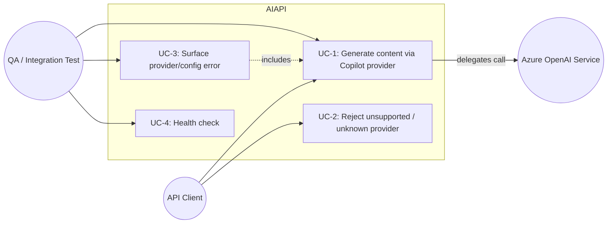
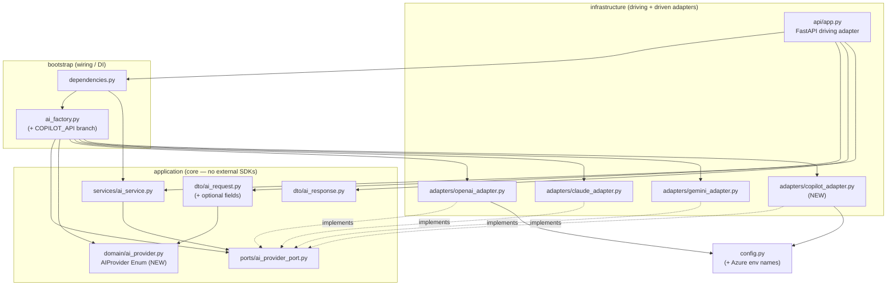
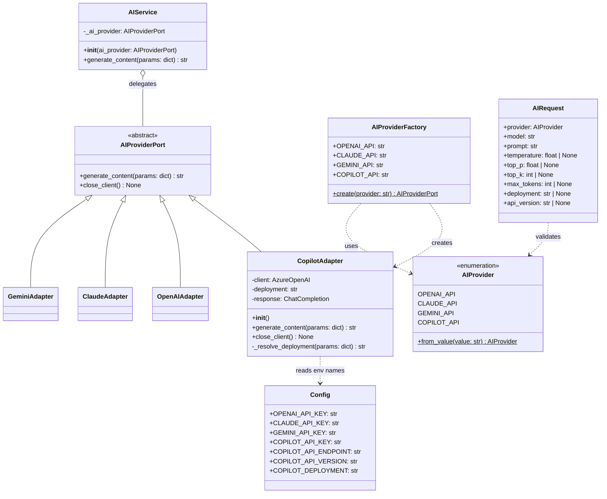
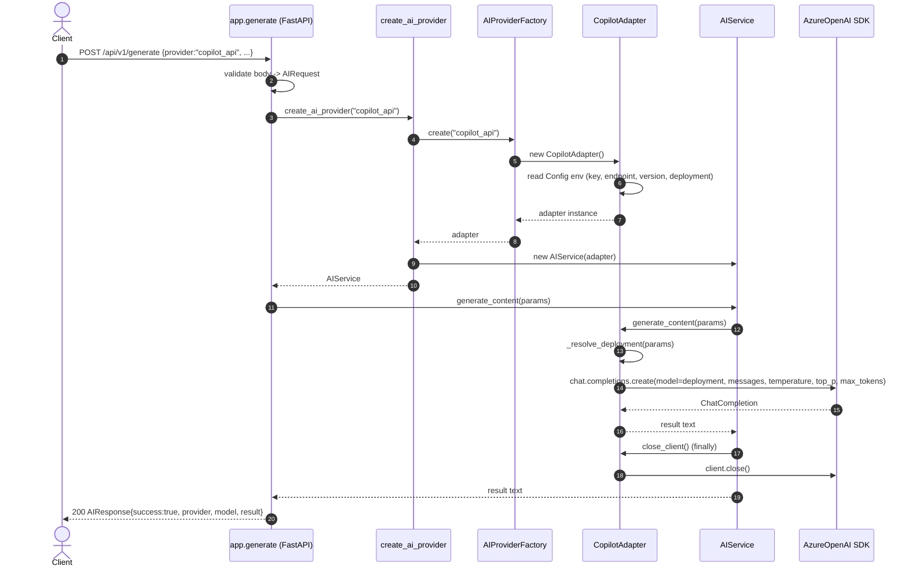
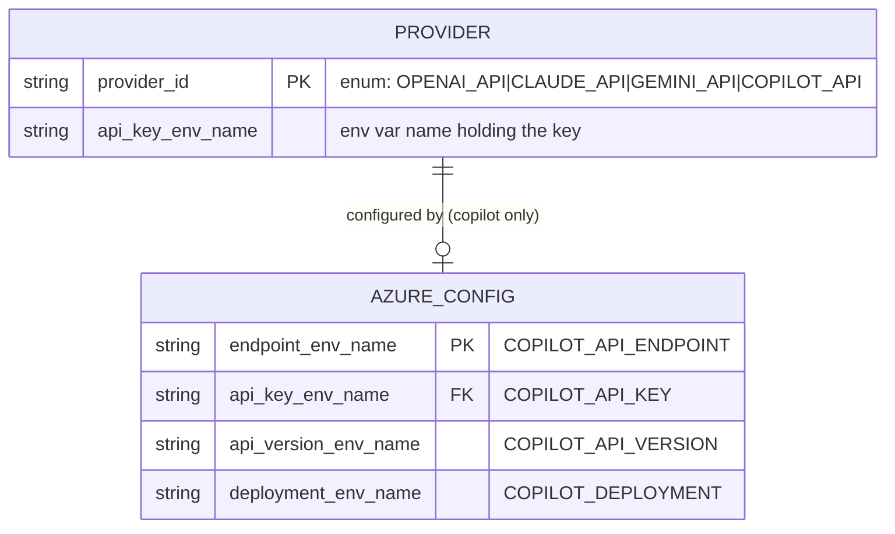

# RFC: Add Microsoft Copilot / Azure OpenAI as a new LLM provider

## 1. Metadata

| Field | Value |
|---|---|
| Title | Add Microsoft Copilot API (Azure OpenAI) as a new LLM provider |
| Author | Software Architect (on behalf of JoseLuisSR) |
| Date | 2026-06-21 |
| Status | Draft |
| Version | 1.0 |
| Affected service | AIAPI (FastAPI gateway) |
| Audience | Backend, Frontend, QA |

---

## 2. Context and problem

AIAPI is a gateway microservice that unifies access to several LLM providers
(OpenAI, Claude, Gemini) behind a single standardized REST endpoint
`POST /api/v1/generate`. The architecture is **Hexagonal (Ports & Adapters)**:
the `application` core depends only on the `AIProviderPort` ABC; each provider is
an `infrastructure` adapter selected by `AIProviderFactory`.

We must add **Microsoft Copilot API** as a fourth provider so clients can send
`"provider": "copilot_api"` and have the prompt processed by a Microsoft-hosted
LLM. Microsoft exposes its production-grade chat-completion LLMs through
**Azure OpenAI Service** (model deployments such as GPT-4o / GPT-4.1 on an Azure
resource). That is the integration surface a backend service should target —
"Microsoft Copilot Studio" is an end-user agent-building product, not a raw
text-generation API suited to this gateway.

The key difference from the existing OpenAI adapter is that Azure OpenAI is
addressed by a **resource endpoint URL + deployment name + API version**, and
authenticated by an **Azure API key** (or Entra ID token), rather than a single
global API key against `api.openai.com`.

### Why it matters
- Expands the gateway's provider catalog with an enterprise-grade Microsoft option
  (data residency, private networking, Azure governance) without changing the
  client contract.
- Validates that the hexagonal design genuinely supports "new provider = new
  adapter + factory entry" — and forces us to pay down provider-identifier tech
  debt that would otherwise compound with every new provider.

---

## 3. Requirements

### 3.1 Functional
- **FR-1**: Clients can call `POST /api/v1/generate` with `provider="copilot_api"`
  and receive a standardized `AIResponse`.
- **FR-2**: A new `CopilotAdapter` implements `AIProviderPort`
  (`generate_content(params: dict) -> str`, `close_client()`), identically to the
  existing adapters.
- **FR-3**: The adapter maps the standardized generation parameters
  (`temperature`, `top_p`, `max_tokens`) to Azure OpenAI chat completions, and
  silently ignores parameters Azure OpenAI does not support (`top_k`).
- **FR-4**: `AIProviderFactory` exposes a `COPILOT_API` identifier and a
  `match/case` branch that instantiates `CopilotAdapter`.
- **FR-5**: Configuration for the Azure resource (API key, endpoint, API version,
  deployment name) is read from environment variables via `Config`.
- **FR-6**: Unsupported / misconfigured provider requests return a well-formed
  error response (HTTP 400 / 500) without leaking secrets.

### 3.2 Non-functional
- **NFR-1 Maintainability**: The `application` core must not change behavior and
  must not import any Azure SDK. Adding the provider must not require editing any
  existing adapter.
- **NFR-2 Consistency**: New code follows existing docstring conventions and
  passes `ruff` (E, F, UP, B, SIM, I, S/bandit) and `mypy`.
- **NFR-3 Security**: Secrets only come from environment; nothing is committed; no
  secret value appears in logs or error messages (bandit-clean).
- **NFR-4 Observability**: Misconfiguration (missing endpoint/deployment) yields a
  deterministic, actionable error rather than an opaque SDK stack trace.
- **NFR-5 Performance**: No regression in request latency for existing providers.
  Azure OpenAI calls are blocking like the others; this RFC documents the shared
  event-loop blocking risk (Tech Debt #4) but does not change the threading model
  (out of scope, tracked separately).
- **NFR-6 Backward compatibility**: Existing clients and existing provider values
  keep working unchanged. New request fields are optional.

### 3.3 Preconditions / Postconditions / Acceptance
- **Precondition**: A valid Azure OpenAI resource exists with a chat-capable model
  deployment, and its endpoint/key/version/deployment are present in the runtime
  environment.
- **Postcondition**: A request with `provider="copilot_api"` returns
  `success=true` and a non-empty `result`, or a structured error.
- **Acceptance**: See Section 11.

---

## 4. Constraints, assumptions, and risks

### Constraints
- **C-1**: Must preserve the hexagonal boundaries — core depends only on the port.
- **C-2**: Python ≥ 3.13.5, FastAPI, Pydantic, `uv` for dependency management.
- **C-3**: A new third-party dependency must be added to `pyproject.toml` /
  `uv.lock` and be type-checkable under `mypy`.
- **C-4**: Azure OpenAI requires a per-request **deployment name** and an
  **API version**; these are not part of today's `AIRequest` contract.

### Assumptions
- **A-1**: The target Microsoft surface is **Azure OpenAI Service** chat
  completions (not Copilot Studio bots). [Critical — confirm with stakeholders.]
- **A-2**: One Azure resource + one default deployment is sufficient for v1; the
  client may optionally override the deployment via the model field.
- **A-3**: Authentication is **API key** based for v1 (Entra ID / managed identity
  is a future enhancement).

### Risks
| ID | Risk | Severity | Mitigation |
|---|---|---|---|
| R-1 | "Copilot" interpreted as Copilot Studio, not Azure OpenAI → wrong SDK | Critical | ADR-001 fixes the surface as Azure OpenAI; confirm before build |
| R-2 | Deployment/version are required by Azure but absent from contract | Important | Provide via env defaults + optional request override (Section 7.5) |
| R-3 | Provider-identifier tech debt compounds (4th duplicated string) | Important | ADR-003 introduces a shared `AIProvider` Enum |
| R-4 | Azure key/endpoint leaked in error text | Critical | Map SDK errors to generic messages; bandit lint; never echo config |
| R-5 | Blocking SDK call on async route degrades throughput | Suggestion | Documented as Tech Debt #4; out of scope for this RFC |

---

## 5. Use cases

### 5.1 Use case diagram



### 5.2 Use case specifications

| Field | UC-1 Generate content via Copilot provider |
|---|---|
| id | UC-1 |
| goal | Generate text from a Microsoft (Azure OpenAI) LLM through the standard endpoint |
| scope | AIAPI gateway, `POST /api/v1/generate` |
| actors | API Client (primary), Azure OpenAI Service (secondary) |
| preconditions | Azure env vars configured; valid `AIRequest` with `provider=copilot_api` |
| main flow | 1. Client POSTs body. 2. FastAPI validates into `AIRequest`. 3. App resolves provider via Factory → `CopilotAdapter`. 4. App builds `params`. 5. `AIService.generate_content(params)` calls adapter. 6. Adapter calls Azure OpenAI chat completions with deployment+version. 7. Adapter returns text; `close_client()` runs in `finally`. 8. App returns `AIResponse(success=true,...)` HTTP 200. |
| exception flow | 3a. Unknown provider → `ValueError` → HTTP 400 (UC-2). 6a. Missing/invalid config → `ValueError` → HTTP 400 (UC-3). 6b. Azure/network error → `Exception` → HTTP 500 (UC-3). |
| postconditions | Response with non-empty `result`; client connection closed |
| acceptance criteria | Given valid config and request, response is 200 with `success=true`, `provider="copilot_api"`, non-empty `result`; adapter called with mapped params; `top_k` not forwarded |

| Field | UC-2 Reject unsupported / unknown provider |
|---|---|
| id | UC-2 |
| goal | Fail fast and clearly when the provider identifier is not recognized |
| scope | `AIProviderFactory`, app error handling |
| actors | API Client |
| preconditions | Request carries an unknown `provider` value |
| main flow | 1. Factory `match/case` hits default. 2. Raises `ValueError`. 3. App maps to HTTP 400 with structured detail. |
| exception flow | None |
| postconditions | No adapter instantiated; no Azure call made |
| acceptance criteria | HTTP 400; body lists the offending value and the supported provider set; no secret data |

| Field | UC-3 Surface provider/config error |
|---|---|
| id | UC-3 |
| goal | Return a deterministic, secret-free error when Copilot is selected but misconfigured or the upstream fails |
| scope | `CopilotAdapter`, app error handling |
| actors | API Client, QA |
| preconditions | Provider `copilot_api` selected; config incomplete OR upstream returns error |
| main flow | 1. Adapter validates required config. 2. Missing config → `ValueError` (HTTP 400). 3. Upstream/SDK exception → propagated → HTTP 500. |
| exception flow | None |
| postconditions | `close_client()` invoked via `finally`; no key/endpoint leaked |
| acceptance criteria | 400 for missing config, 500 for upstream failure; error text contains no API key, endpoint, or deployment value |

| Field | UC-4 Health check |
|---|---|
| id | UC-4 |
| goal | Confirm the service is up |
| scope | `GET /health` |
| actors | QA, monitoring |
| preconditions | Service running |
| main flow | 1. GET `/health` → `{"status":"ok"}` HTTP 200 |
| exception flow | None |
| postconditions | None |
| acceptance criteria | HTTP 200 `{"status":"ok"}` (unchanged) |

---

## 6. Proposed solution

### 6.1 Evaluated alternatives (Python client library)

| Option | Library | Pros | Cons |
|---|---|---|---|
| **A (chosen)** | `openai` SDK via `AzureOpenAI` client | Already a dependency; same mental model as `OpenAIAdapter`; first-class typing; supports `azure_endpoint`, `api_version`, deployment-as-`model`; returns identical `choices[0].message.content` shape | Requires passing `api_version`; deployment name overloads the `model` field |
| B | `azure-ai-inference` | Unified Azure AI surface (also non-OpenAI models) | New dependency + new response shape; diverges from existing adapter style; more abstraction than needed for v1 |
| C | Raw `requests`/`httpx` to REST API | Zero SDK lock-in | Hand-rolled auth, retries, error mapping, pagination; more code to lint/test; reinvents the SDK; bandit surface for URL building |

### 6.2 Trade-offs and decision

**Decision: Option A — reuse the already-installed `openai` SDK through its
`AzureOpenAI` client class.**

Rationale (objective criteria):
- **Cost / effort**: zero new runtime dependency (the `openai` package is already
  pinned at `>=2.37.0`). Options B and C add dependencies and/or bespoke code.
- **Consistency / maintainability**: `AzureOpenAI` returns the same
  `chat.completions.create(...).choices[0].message.content` structure as the
  existing `OpenAIAdapter`, so the adapter body is nearly identical and trivial to
  review and test. This maximizes cohesion with the existing codebase.
- **Type safety**: `openai` ships type stubs; `mypy` passes without extra work.
- **Risk**: lowest. The deployment-name-as-`model` quirk is a one-line mapping
  documented in Section 7.5.

Options B and C are discarded: B introduces a divergent response model and a new
dependency for capabilities (non-OpenAI Azure models) we do not need in v1; C
re-implements transport, auth, and error handling that the SDK already provides
and increases the security/lint surface for no benefit.

### 6.3 High-level impact and effort
- **Backend**: 1 new adapter, factory branch, `Config` additions, optional
  `AIRequest` fields, shared provider Enum (tech-debt fix). ~1–2 days.
- **Frontend**: none required; optionally expose `copilot_api` in any provider
  picker and the optional `deployment`/`api_version` fields. ~0.5 day.
- **QA**: unit tests for the adapter (mocked SDK), factory test, contract/e2e test
  with a sandbox Azure deployment. ~1–1.5 days.
- **Ops**: provision Azure OpenAI resource + deployment; set 4 env vars. ~0.5 day.

---

## 7. Architectural design

### 7.1 Architectural style: Hexagonal (Ports & Adapters)

The feature slots into the existing hexagon as a new **driven adapter** on the
outbound side. The `application` core (`AIProviderPort`, `AIService`, DTOs) is
untouched in behavior. The only cross-cutting change is the introduction of a
shared `AIProvider` Enum (a value object) to remove the duplicated provider
identifier strings — placed in the `application` layer so both the core (DTO
validation) and the bootstrap (factory) can depend on it without violating the
dependency rule (domain does not depend on infrastructure).

Justification: the design's whole premise is "new provider = new adapter + one
factory entry, core untouched." This RFC honors that and uses the opportunity to
strengthen the seam (Enum) so future providers are cheaper and safer to add.

### 7.2 Package diagram



**Allowed-dependency rules (enforced by review):**
- `application` may depend only on `application` (and stdlib/Pydantic). It must
  never import `infrastructure` or any provider SDK.
- `bootstrap` may import `application` (port, service, enum) and `infrastructure`
  (concrete adapters) — it is the composition root.
- `infrastructure` adapters import `application.ports`, `config`, and their SDK.
- `config.py` is dependency-free configuration shared by adapters.

### 7.3 Class diagram



**Package assignment:**
`AIProvider` → `application/domain`; `AIRequest`/`AIResponse` → `application/dto`;
`AIProviderPort`/`AIService` → `application`; `AIProviderFactory` →
`bootstrap`; `CopilotAdapter` → `infrastructure/adapters`; `Config` → root.

### 7.4 Sequence diagram — successful generate with `copilot_api`



### 7.5 Parameter mapping (Copilot / Azure OpenAI adapter)

Azure OpenAI chat completions accept the same sampling controls as OpenAI. The
deployment name (not the public model name) is what is passed as the `model`
argument, and an `api_version` is required at client construction.

| AIRequest field | Azure OpenAI SDK target | Supported? | Notes |
|---|---|---|---|
| `model` | n/a (informational / fallback deployment) | partial | Public model label; used as deployment if `deployment` absent and env default absent |
| `deployment` (new, optional) | `model=` arg of `chat.completions.create` | yes | Deployment name on the Azure resource; precedence: request `deployment` > `model` > env `COPILOT_DEPLOYMENT` |
| `api_version` (new, optional) | `api_version=` of `AzureOpenAI(...)` | yes | Defaults to env `COPILOT_API_VERSION` |
| `prompt` | `messages=[{"role":"user","content":prompt}]` | yes | Same shape as OpenAI adapter |
| `temperature` | `temperature=` | yes | Forwarded when not None |
| `top_p` | `top_p=` | yes | Forwarded when not None |
| `max_tokens` | `max_tokens=` (or `max_completion_tokens` for o-series) | yes | v1 uses `max_tokens`; note below |
| `top_k` | — | **no** | Azure OpenAI chat completions do not support `top_k`; silently ignored |

> Note on `max_completion_tokens`: newer reasoning ("o-series") deployments reject
> `max_tokens` in favor of `max_completion_tokens`. v1 targets standard GPT
> deployments and uses `max_tokens`. Supporting o-series is a tracked follow-up
> (see ADR-002 consequences); the adapter is the only place that would change.

### 7.6 Data model

#### 7.6.1 Configuration entities (ER view)

No relational database is used by AIAPI; persistence is limited to environment
configuration. The "entities" below model configuration ownership for clarity.



> Indexes / lookups: provider resolution is an O(1) `match/case` on
> `provider_id`; no DB indexes apply. Environment lookups are keyed by the exact
> env var name strings centralized in `Config`.

#### 7.6.2 Updated `Config` (env var names)

```text
OPENAI_API_KEY        = "OPENAI_API_KEY"
GEMINI_API_KEY        = "GEMINI_API_KEY"
CLAUDE_API_KEY        = "CLAUDE_API_KEY"
COPILOT_API_KEY       = "COPILOT_API_KEY"        # Azure OpenAI resource key
COPILOT_API_ENDPOINT  = "COPILOT_API_ENDPOINT"   # https://<resource>.openai.azure.com/
COPILOT_API_VERSION   = "COPILOT_API_VERSION"    # e.g. 2024-10-21
COPILOT_DEPLOYMENT    = "COPILOT_DEPLOYMENT"      # default deployment name
```

#### 7.6.3 New `.env` keys (values are examples, never commit real values)

```dotenv
# Microsoft Copilot / Azure OpenAI
COPILOT_API_KEY=<azure-openai-resource-key>
COPILOT_API_ENDPOINT=https://my-resource.openai.azure.com/
COPILOT_API_VERSION=2024-10-21
COPILOT_DEPLOYMENT=gpt-4o
```

#### 7.6.4 JSON models

**Request (minimal):**
```json
{
  "provider": "copilot_api",
  "model": "gpt-4o",
  "prompt": "Write a one-sentence summary about Python."
}
```

**Request (full, with Azure-specific overrides):**
```json
{
  "provider": "copilot_api",
  "model": "gpt-4o",
  "prompt": "Write a one-sentence summary about Python.",
  "temperature": 0.2,
  "top_p": 0.9,
  "top_k": 20,
  "max_tokens": 256,
  "deployment": "gpt-4o-prod",
  "api_version": "2024-10-21"
}
```
> `top_k` is accepted by the contract for uniformity but is ignored by the
> Copilot adapter.

**Success response:**
```json
{
  "success": true,
  "provider": "copilot_api",
  "model": "gpt-4o",
  "result": "Python is a high-level, general-purpose programming language.",
  "error": null
}
```

**Error response (unsupported provider, HTTP 400):**
```json
{
  "detail": {
    "code": "UNSUPPORTED_PROVIDER",
    "message": "Provider 'copilot' is not supported.",
    "supported": ["openai_api", "claude_api", "gemini_api", "copilot_api"]
  }
}
```

**Error response (missing Azure config, HTTP 400):**
```json
{
  "detail": {
    "code": "PROVIDER_MISCONFIGURED",
    "message": "Copilot provider is not configured. Required environment variables are missing."
  }
}
```

> Note: today the API returns errors as `HTTPException.detail` (a plain string)
> and leaves `AIResponse.error` unused (Tech Debt #2). The structured `detail`
> object above is the **recommended** shape. ADR-004 records this as an
> Important (non-blocking) improvement; if deferred, keep the current string
> detail and the JSON above degrades to `{"detail": "..."}`.

### 7.7 API contract (OpenAPI 3.x)

```yaml
openapi: 3.0.3
info:
  title: AIAPI
  description: AI API Gateway for OpenAI, Gemini, Claude, and Microsoft Copilot (Azure OpenAI)
  version: 0.2.0
paths:
  /api/v1/generate:
    post:
      operationId: generateContent
      summary: Generate text from a selected LLM provider
      requestBody:
        required: true
        content:
          application/json:
            schema:
              $ref: '#/components/schemas/AIRequest'
            examples:
              copilotMinimal:
                summary: Minimal Copilot request
                value:
                  provider: copilot_api
                  model: gpt-4o
                  prompt: Write a one-sentence summary about Python.
              copilotFull:
                summary: Copilot request with Azure overrides
                value:
                  provider: copilot_api
                  model: gpt-4o
                  prompt: Write a one-sentence summary about Python.
                  temperature: 0.2
                  top_p: 0.9
                  max_tokens: 256
                  deployment: gpt-4o-prod
                  api_version: '2024-10-21'
      responses:
        '200':
          description: Successful generation
          content:
            application/json:
              schema:
                $ref: '#/components/schemas/AIResponse'
        '400':
          description: Unsupported provider or invalid/misconfigured request
          content:
            application/json:
              schema:
                $ref: '#/components/schemas/ErrorResponse'
        '422':
          description: Request body failed schema validation
          content:
            application/json:
              schema:
                $ref: '#/components/schemas/ErrorResponse'
        '500':
          description: Unexpected internal or upstream provider error
          content:
            application/json:
              schema:
                $ref: '#/components/schemas/ErrorResponse'
  /health:
    get:
      operationId: healthCheck
      summary: Service health check
      responses:
        '200':
          description: Service is healthy
          content:
            application/json:
              schema:
                type: object
                properties:
                  status:
                    type: string
                    example: ok
components:
  schemas:
    ProviderId:
      type: string
      enum: [openai_api, claude_api, gemini_api, copilot_api]
      description: LLM provider identifier
    AIRequest:
      type: object
      required: [provider, model, prompt]
      properties:
        provider:
          $ref: '#/components/schemas/ProviderId'
        model:
          type: string
          description: Public model name (also used as Azure deployment fallback)
        prompt:
          type: string
        temperature:
          type: number
          format: float
          nullable: true
        top_p:
          type: number
          format: float
          nullable: true
        top_k:
          type: integer
          nullable: true
          description: Ignored by openai_api and copilot_api providers
        max_tokens:
          type: integer
          nullable: true
        deployment:
          type: string
          nullable: true
          description: Azure OpenAI deployment name (copilot_api only)
        api_version:
          type: string
          nullable: true
          description: Azure OpenAI API version (copilot_api only)
    AIResponse:
      type: object
      required: [success]
      properties:
        success:
          type: boolean
        provider:
          type: string
          nullable: true
        model:
          type: string
          nullable: true
        result:
          type: string
          nullable: true
        error:
          type: string
          nullable: true
    ErrorResponse:
      type: object
      properties:
        detail:
          oneOf:
            - type: string
            - type: object
              properties:
                code:
                  type: string
                message:
                  type: string
                supported:
                  type: array
                  items:
                    type: string
```

### 7.8 Quality attributes and cross-cutting concerns

- **Security / secrets**: Azure key, endpoint, version, deployment read only from
  environment via `Config`; never logged or echoed in errors. Adapter constructs
  the `AzureOpenAI` client with the key from `os.environ.get`. Bandit (S rules)
  must stay clean — no hardcoded secrets, no insecure URL handling.
- **Authentication / authorization**: v1 uses Azure API-key auth to the upstream;
  the gateway itself inherits its existing (un)authenticated posture — no change.
  Entra ID / managed identity is a documented future enhancement.
- **Error handling**: Factory `ValueError` → HTTP 400; adapter config validation
  `ValueError` → HTTP 400; upstream/SDK exceptions → HTTP 500. Error bodies carry
  a stable `code` and a safe `message`, never secrets.
- **Configuration validation**: `CopilotAdapter.__init__` (or a small guard)
  verifies endpoint, key, version, and a resolvable deployment are present, and
  raises a clear `ValueError` otherwise (fail fast, actionable message).
- **Transactions**: not applicable (stateless, single upstream call). Client
  lifecycle is guaranteed by `AIService`'s `try/finally` → `close_client()`.
- **Caching**: out of scope for v1 (each prompt is unique); noted as a possible
  future optimization for identical prompt+params.
- **Observability**: structured error codes enable dashboards/alerting; a future
  enhancement may add request-id / latency logging (not in this RFC).
- **Performance**: blocking SDK call on an `async` route shares Tech Debt #4 with
  all providers; documented, not changed here.

---

## 8. Selected design patterns

| Pattern | Where | Why (coupling / cohesion) |
|---|---|---|
| **Adapter** | `CopilotAdapter` wraps `AzureOpenAI` behind `AIProviderPort` | Decouples the core from the Azure SDK; the SDK's API shape stays isolated in one class. High cohesion (one provider concern per class). |
| **Strategy** | All adapters are interchangeable `AIProviderPort` strategies selected at runtime | `AIService` depends on the abstraction, not concretions (DIP); adding Copilot adds a strategy without touching the service. |
| **Factory Method** | `AIProviderFactory.create` adds a `COPILOT_API` branch | Centralizes provider instantiation; callers stay ignorant of concrete classes, reducing coupling to construction details. |
| **Value Object / Enum** | new `AIProvider` enum | Removes duplicated identifier strings (Tech Debt #1); a single source of truth that both DTO validation and the factory share, raising cohesion and eliminating drift. |
| **Dependency Injection** | `create_ai_provider` composes adapter + service | Composition root wiring keeps the core free of construction concerns (SRP). |

SOLID notes: **SRP** (adapter does only Azure mapping), **OCP** (new provider via
extension, existing files' behavior unchanged), **LSP** (adapter substitutable
for the port), **DIP** (service/factory depend on the port abstraction).

---

## 9. Impact and implementation plan

### Backend
1. Add `AIProvider` enum in `src/application/domain/ai_provider.py` with values
   `openai_api`, `claude_api`, `gemini_api`, `copilot_api` and a `from_value`
   helper.
2. Update `AIProviderFactory`: add `COPILOT_API` constant, reference the enum,
   add `case` → `CopilotAdapter()`; keep raising `ValueError` on default.
3. Add Azure env-var names to `Config` (key, endpoint, version, deployment).
4. Create `CopilotAdapter(AIProviderPort)` in
   `src/infrastructure/adapters/copilot_adapter.py`: build `AzureOpenAI(api_key,
   azure_endpoint, api_version)`; `generate_content` maps params per Section 7.5
   (forward only non-None values; resolve deployment precedence; never forward
   `top_k`); `close_client` calls `client.close()`. Validate config; raise
   `ValueError` on missing config.
5. Extend `AIRequest` with optional `deployment` and `api_version`; (recommended)
   type `provider` as `AIProvider` for validation. Forward both new fields in the
   `params` dict in `app.generate`.
6. (Recommended, ADR-004) Standardize structured error `detail`.
7. Update `pyproject.toml`/`uv.lock` only if a newer `openai` pin is needed
   (`AzureOpenAI` already available in `openai>=2.37.0`).

### Frontend
1. Add `copilot_api` to any provider selector.
2. Optionally surface `deployment` and `api_version` fields when Copilot is chosen.
3. Display the structured error `code`/`message` if ADR-004 is adopted.

### QA
1. Unit-test `CopilotAdapter` with a mocked `AzureOpenAI` client: assert
   `chat.completions.create` is called with mapped params and **without** `top_k`;
   assert deployment precedence (request > model > env); assert `close_client`.
2. Test config-missing path raises `ValueError` → 400.
3. Factory test: `create("copilot_api")` returns a `CopilotAdapter`; unknown →
   `ValueError` → 400.
4. Contract test of `POST /api/v1/generate` with the new examples; schema-validate
   responses against the OpenAPI.
5. E2E smoke test against a sandbox Azure deployment (gated by env presence).
6. Negative test: error bodies contain no key/endpoint/deployment values.
7. Mirror the test in `tests/infrastructure/adapters/test_copilot_adapter.py`
   following the existing `unittest`/`Mock` style.

---

## 10. Decisions (embedded ADRs)

### ADR-001 — Target Azure OpenAI Service, not Copilot Studio
- **Context**: "Microsoft Copilot" is ambiguous (Copilot Studio agent builder vs.
  Azure OpenAI text-generation API). AIAPI is a raw text-generation gateway.
- **Options**: (a) Azure OpenAI chat completions; (b) Copilot Studio Direct Line /
  bot API; (c) Microsoft 365 Copilot APIs.
- **Decision**: (a) Azure OpenAI Service.
- **Consequences**: Clean fit to the existing OpenAI-style adapter; requires
  endpoint + deployment + api_version config. (b)/(c) are agent/productivity
  surfaces that do not match the gateway's prompt→text contract.

### ADR-002 — Use the `openai` SDK `AzureOpenAI` client
- **Context**: Need a Python client for Azure OpenAI.
- **Options**: `openai.AzureOpenAI`; `azure-ai-inference`; raw HTTP.
- **Decision**: `openai.AzureOpenAI` (already a dependency).
- **Consequences**: Zero new dependency, identical response shape to OpenAI
  adapter, mypy-clean. Deployment-as-`model` quirk handled in the adapter;
  o-series `max_completion_tokens` deferred.

### ADR-003 — Introduce a shared `AIProvider` enum
- **Context**: Provider identifiers are duplicated string constants (Tech Debt #1);
  a 4th provider compounds the drift and there is no DTO validation.
- **Options**: (a) add another raw string; (b) shared enum in the application layer.
- **Decision**: (b).
- **Consequences**: Single source of truth shared by DTO and factory; enables
  request validation and a complete `supported` list in errors. Slight refactor of
  the factory and DTO; backward-compatible string values preserved.

### ADR-004 — Standardize structured error responses (recommended)
- **Context**: `AIResponse.error` is unused; errors are plain `HTTPException.detail`
  strings, and the 400 message discards the real `ValueError` (Tech Debt #2, #3).
- **Options**: (a) keep string detail; (b) structured `{code,message,...}` detail.
- **Decision**: (b) recommended; non-blocking for this feature.
- **Consequences**: Better client UX and QA assertability; small change to error
  raising in `app.py`. If deferred, the feature still ships with string details.

---

## 11. Acceptance criteria

- **AC-1**: `POST /api/v1/generate` with `provider="copilot_api"` and valid config
  returns HTTP 200, `success=true`, `provider="copilot_api"`, non-empty `result`.
- **AC-2**: The adapter calls `chat.completions.create` with `model=<resolved
  deployment>`, the user message, and only the non-None sampling params; `top_k`
  is never forwarded.
- **AC-3**: Deployment precedence is request `deployment` > `model` > env
  `COPILOT_DEPLOYMENT`; `api_version` falls back to `COPILOT_API_VERSION`.
- **AC-4**: Missing required Azure config yields HTTP 400 with a secret-free,
  actionable message; upstream failure yields HTTP 500.
- **AC-5**: Unknown provider yields HTTP 400 listing the supported providers.
- **AC-6**: `application` core imports no Azure SDK; existing providers' behavior
  and tests are unchanged.
- **AC-7**: All new code passes `ruff` (E, F, UP, B, SIM, I, S) and `mypy`;
  adapter unit test mirrors existing style and passes.
- **AC-8**: No API key, endpoint, or deployment value appears in any log or error
  body (verified by a negative test).

### Prioritized open items
- **Critical**: Confirm ADR-001 (Azure OpenAI vs. Copilot Studio) with stakeholders
  before implementation.
- **Important**: Adopt ADR-003 (shared enum) to avoid compounding Tech Debt #1;
  decide on ADR-004 (structured errors).
- **Suggestion**: Plan o-series `max_completion_tokens` support and the
  blocking-SDK event-loop fix (Tech Debt #4) as follow-ups.
```
